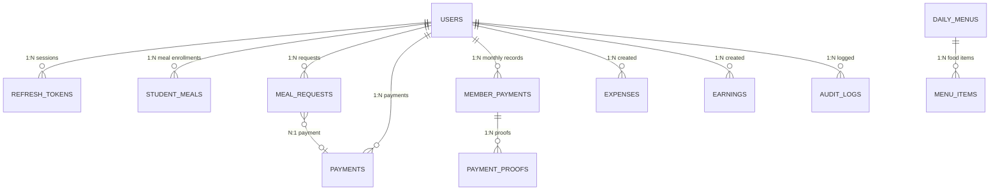
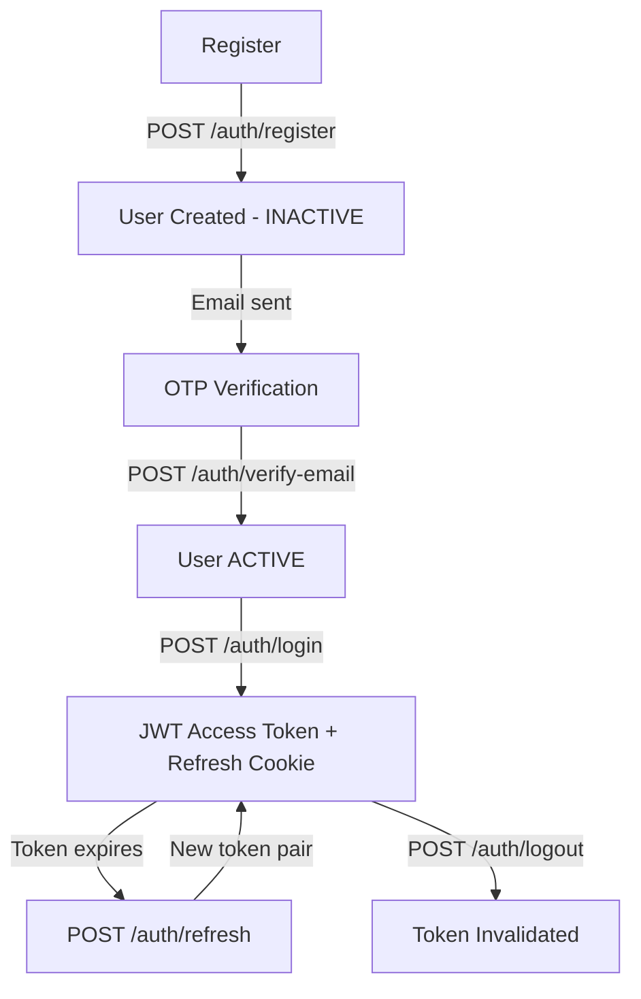
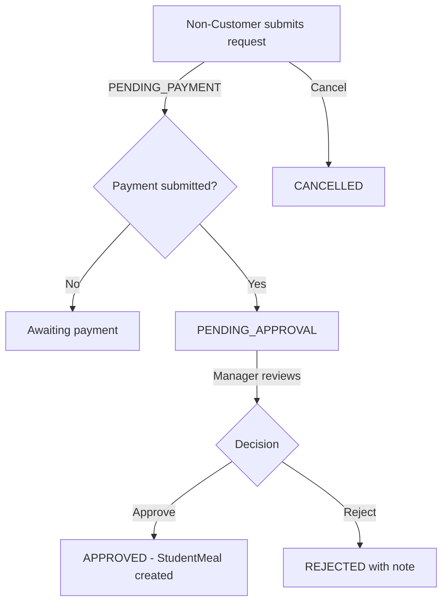
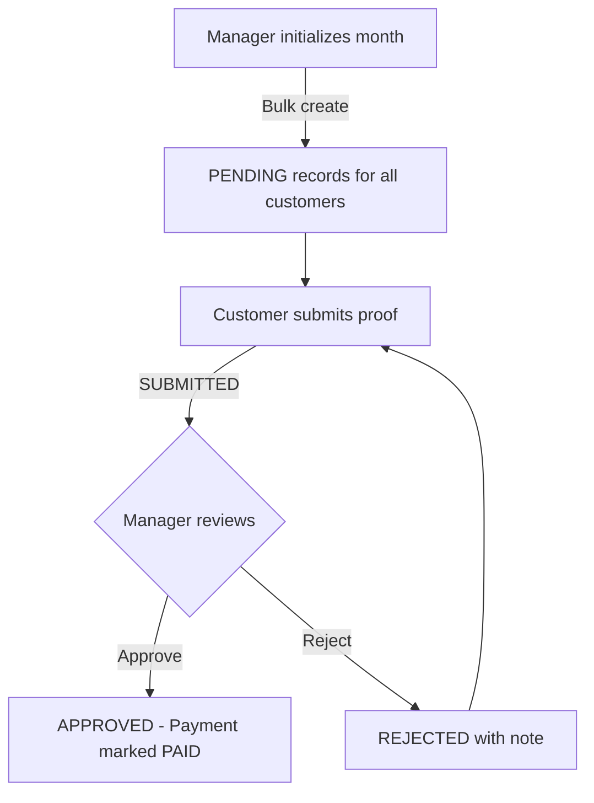

# UDMS — Entity-Relationship Diagram (Mermaid)

> Paste into any Mermaid renderer (GitHub markdown, mermaid.live, VS Code plugin)

## Complete ER Diagram

```mermaid
erDiagram
    users {
        varchar(36) id PK
        varchar(20) student_id UK
        varchar(50) username UK
        varchar(150) full_name
        varchar(255) email UK
        varchar(255) password_hash
        enum role "PROVOST | DINING_MANAGER | CUSTOMER | NON_CUSTOMER"
        varchar(100) department
        varchar(20) batch
        varchar(100) hall_name
        varchar(20) phone
        varchar(500) profile_image
        enum status "ACTIVE | INACTIVE | SUSPENDED"
        tinyint email_verified
        int failed_attempts
        datetime locked_until
        datetime last_login
        datetime created_at
        datetime updated_at
    }

    refresh_tokens {
        varchar(36) id PK
        varchar(36) user_id FK
        varchar(255) token_hash UK
        datetime expires_at
        datetime created_at
    }

    meal_schedules {
        varchar(36) id PK
        enum meal_type UK "BREAKFAST | LUNCH | DINNER"
        time start_time
        time end_time
        time cancel_deadline
        tinyint is_active
        varchar(36) created_by FK
        varchar(36) updated_by FK
        datetime created_at
        datetime updated_at
    }

    daily_menus {
        varchar(36) id PK
        date date
        enum meal_type "BREAKFAST | LUNCH | DINNER"
        tinyint is_cancelled
        varchar(36) created_by FK
        varchar(36) updated_by FK
        datetime created_at
        datetime updated_at
    }

    menu_items {
        varchar(36) id PK
        varchar(36) menu_id FK
        varchar(200) food_name
        varchar(100) quantity
        text notes
        datetime created_at
    }

    student_meals {
        varchar(36) id PK
        varchar(36) user_id FK
        date date
        enum meal_type "BREAKFAST | LUNCH | DINNER"
        enum status "ACTIVE | CANCELLED"
        datetime cancelled_at
        datetime created_at
        datetime updated_at
    }

    payments {
        varchar(36) id PK
        varchar(36) user_id FK
        varchar(36) request_id
        decimal amount
        enum payment_method "CASH | MOBILE_BANKING | BANK_TRANSFER | OTHER"
        varchar(100) reference_no
        enum status "PENDING | COMPLETED | FAILED | REFUNDED"
        text note
        datetime created_at
        datetime updated_at
    }

    meal_requests {
        varchar(36) id PK
        varchar(36) user_id FK
        date date
        enum meal_type "BREAKFAST | LUNCH | DINNER"
        text reason
        enum status "PENDING_PAYMENT | PENDING_APPROVAL | APPROVED | REJECTED | CANCELLED"
        varchar(36) payment_id FK
        varchar(36) reviewed_by FK
        datetime reviewed_at
        text rejection_note
        datetime created_at
        datetime updated_at
    }

    expenses {
        varchar(36) id PK
        varchar(200) name
        enum category "FOOD_PURCHASE | UTILITIES | SALARY | EQUIPMENT | MAINTENANCE | MISCELLANEOUS"
        decimal amount
        text description
        date expense_date
        varchar(36) created_by FK
        varchar(36) updated_by FK
        datetime created_at
        datetime updated_at
    }

    earnings {
        varchar(36) id PK
        varchar(200) description
        enum category "MEAL_PAYMENT | DEPOSIT | GRANT | OTHER"
        decimal amount
        date earning_date
        text notes
        varchar(36) created_by FK
        datetime created_at
        datetime updated_at
    }

    member_payments {
        varchar(36) id PK
        varchar(36) user_id FK
        int year
        int month
        decimal amount_due
        decimal amount_paid
        enum status "PAID | PENDING"
        datetime created_at
        datetime updated_at
    }

    payment_proofs {
        varchar(36) id PK
        varchar(36) member_payment_id FK
        varchar(36) user_id FK
        enum proof_type "IMAGE | TRANSACTION_ID | TEXT_NOTE"
        text proof_value
        enum status "SUBMITTED | APPROVED | REJECTED"
        varchar(36) reviewed_by FK
        datetime reviewed_at
        text rejection_note
        datetime created_at
    }

    audit_logs {
        bigint id PK "AUTO_INCREMENT"
        varchar(36) user_id FK
        varchar(100) action
        varchar(50) entity_type
        varchar(36) entity_id
        json old_value
        json new_value
        varchar(45) ip_address
        varchar(500) user_agent
        datetime created_at
    }

    system_settings {
        bigint id PK "AUTO_INCREMENT"
        varchar(100) key_name UK
        text value
        varchar(500) description
        varchar(36) updated_by FK
        datetime updated_at
    }

    %% ── Relationships ──────────────────────────────────

    users ||--o{ refresh_tokens : "has sessions"
    users ||--o{ student_meals : "enrolls in meals"
    users ||--o{ meal_requests : "submits requests"
    users ||--o{ payments : "makes payments"
    users ||--o{ member_payments : "monthly billing"
    users ||--o{ expenses : "creates expenses"
    users ||--o{ earnings : "records earnings"
    users ||--o{ audit_logs : "generates logs"

    users ||--o{ meal_schedules : "creates/updates"
    users ||--o{ daily_menus : "creates/updates"
    users ||--o{ payment_proofs : "submits proofs"
    users ||--o{ system_settings : "updates settings"

    daily_menus ||--o{ menu_items : "contains items"
    meal_requests }o--|| payments : "linked to payment"
    meal_requests }o--|| users : "reviewed by"
    member_payments ||--o{ payment_proofs : "has proofs"
    payment_proofs }o--|| users : "reviewed by"
```

## Simplified Overview Diagram

## Workflow Diagrams

### Authentication Flow

### Meal Request Flow (Non-Customer)

### Payment Proof Flow

